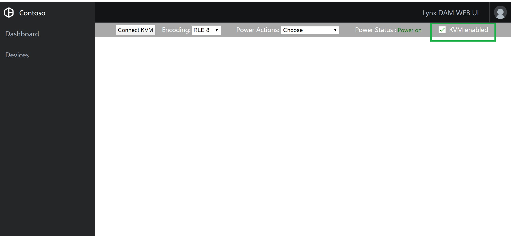
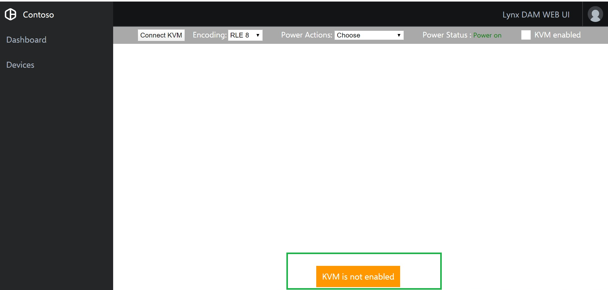
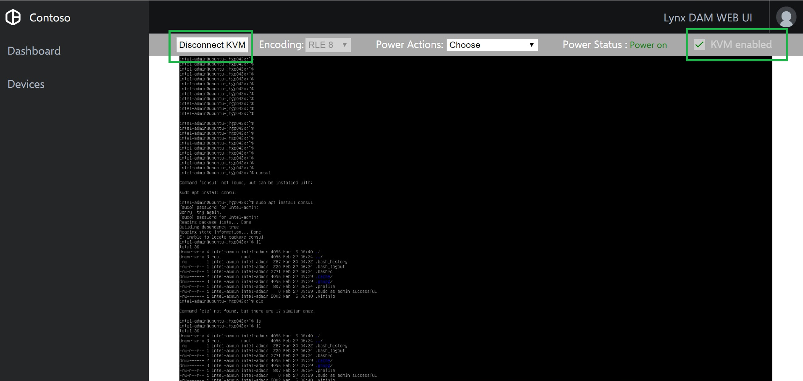
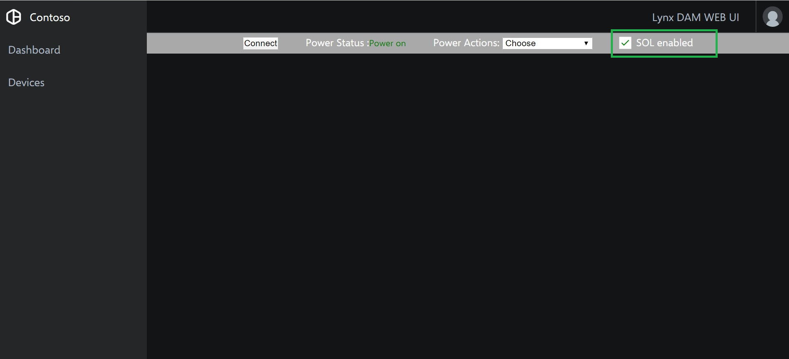
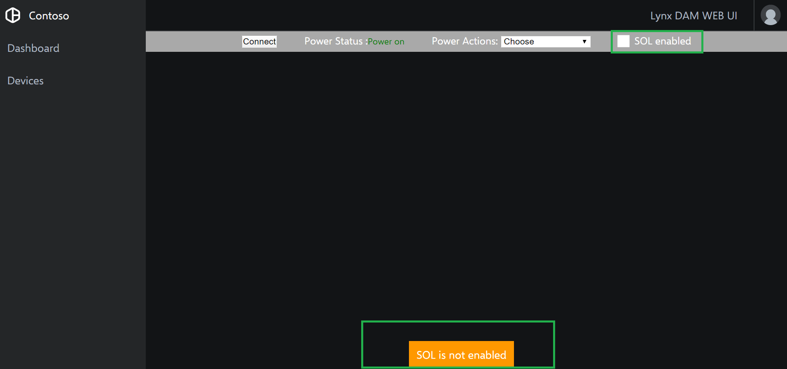
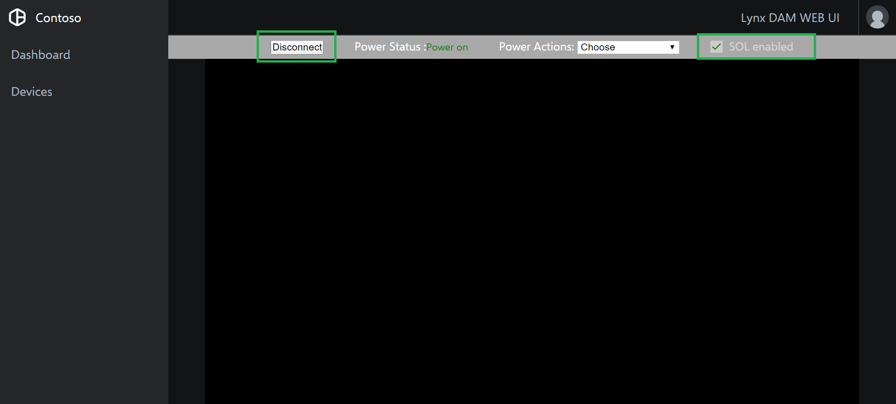

# Quickstart - Using AMT features

This document provides information on how to use AMT features from the UI. 

Using the AMT features solution, one can enable/disable the KVM and SOL controls through Web console.

## KVM 

A checkbox on the header of KVM control page has been provided to enable or disable the KVM.

	 

On load of the page the feature details are fetched from the AMT device and integrated with checkbox status. If the KVM feature is not enabled, a message saying *KVM is not enabled* will be displayed on the bottom center of the page.

	 

When KVM control is connected, the checkbox to enable/disable will be greyed out.

	 

## SOL

A checkbox on the header of SOL control page has been provided to enable or disable the SOL.

	 

On load of the page the feature details are fetched from the AMT device and integrated with checkbox status. If the SOL feature is not enabled, a message saying *SOL is not enabled* will be displayed on the bottom center of the page.

	 

When SOL control is connected, the checkbox to enable/disable will be greyed out.

	 

