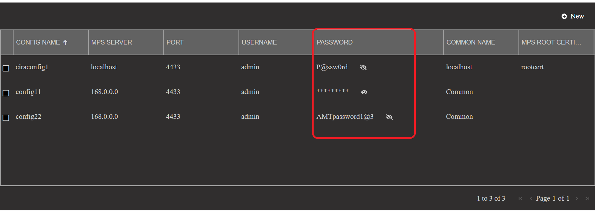
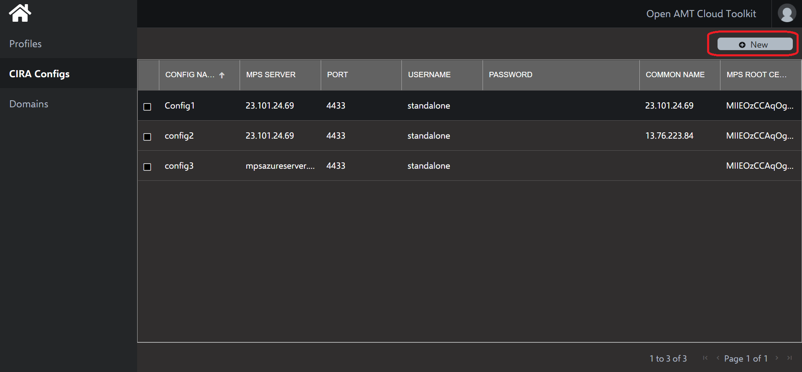
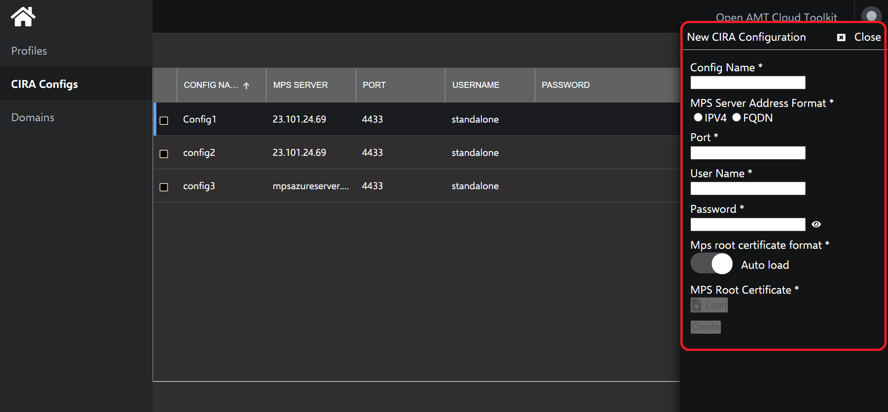
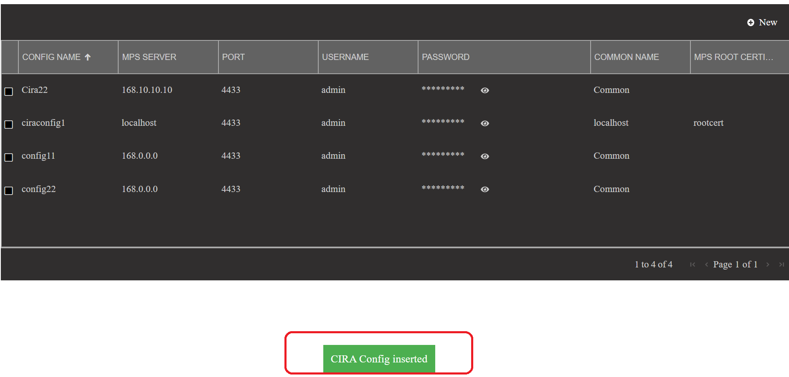
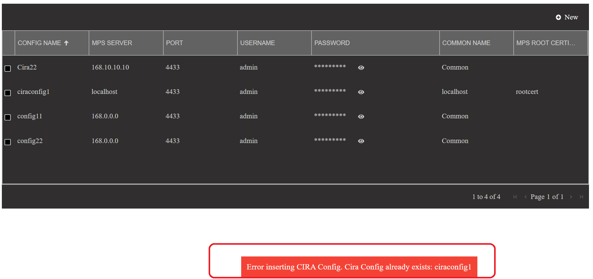
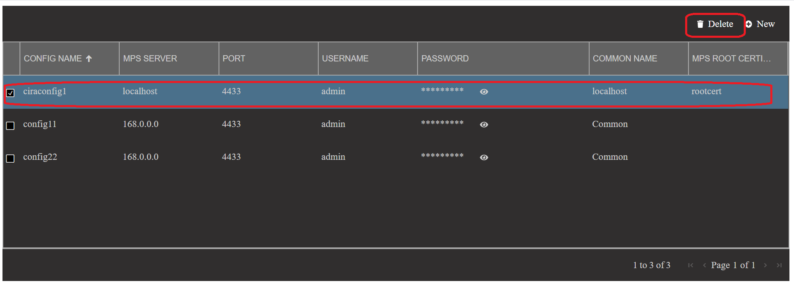
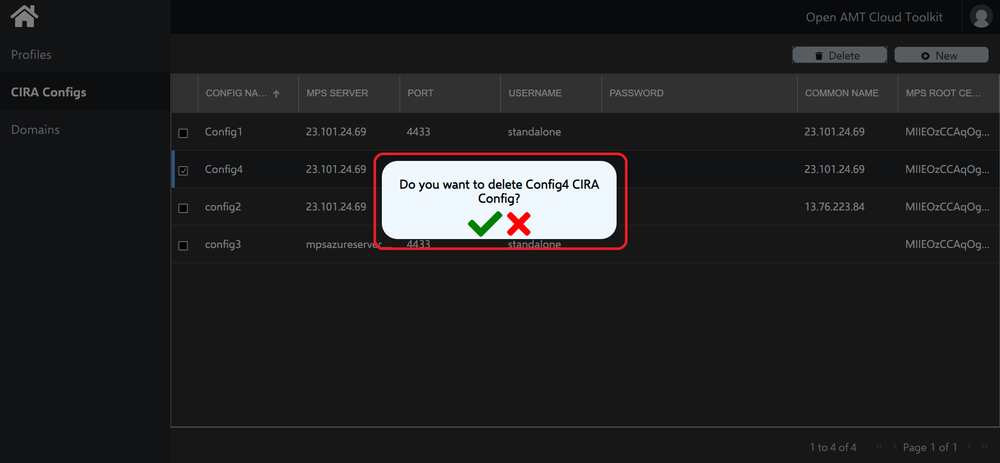
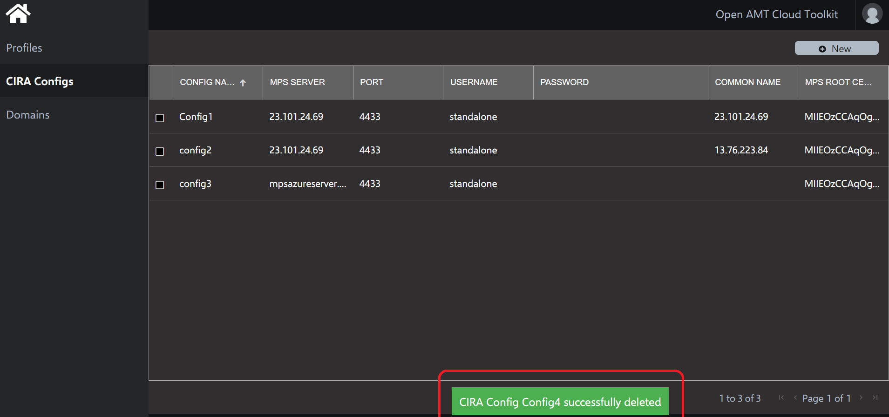
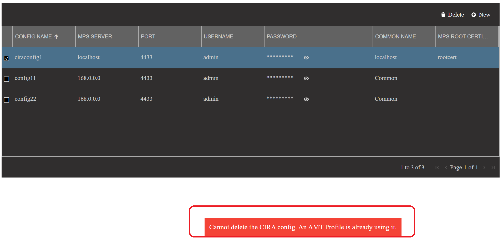

# Quickstart - Using CIRA configs control features

This document provides information on how to use CIRA configs control features from the UI. 

Using the CIRA configs control  solution, one can add and delete CIRA configs from the Database using RPS microservices through Web console.

## CIRA configs control

On loading the CIRA configs control in the web console, one will see the list of CIRA configs avaialbale in the database in a tabular format as below

	 

In the CIRA configs grid, the password details are masked and can be un-masked by clicking on the *eye* icon as shown below.

	 

### Create CIRA configs

A button 'new' is provided to add a new CIRA config to the database.

	 

On click of 'new' button a flyout with a form to enter the CIRA config details will open and one can enter the details and click the create button to save the CIRA config in database.

	 

#### Input field validations

Listed below are the validations against the mandatory fields for the create profile form

| Field Name | Validation |
|--|--|
|Config Name | Should be unique, can contain alphanumeric, special characters |
|MPS server address format | radio buttons with IPv4, IPv6 and FQDN options |
|MPS Server address| Validated based on the MPS server address format selection|
| MPS Port | Numeric value and the value must be  between 1024 and 49151 |
|User name| Can contain alphanumeric, special characters |
|Password|  Should be between 8 and 32 in length and must have at least one lowercase, one uppercase alphabets, one numeric digit and one special character |
|Common Name | Can contain alphanumeric, special characters |
|MPS Root certificate| TBD |

On successful insertion of CIRA config a success message will be shown  on the page as shown below and newly added CIRA config will be shown in the CIRA config list.

	 

In case if a user tries to add an CIRA config script which already exists in the database, then an error message will be shown to the user as shown below.

	 

### Delete CIRA config

Upon selecting any CIRA config by clicking on the checkbox against the CIRA config details row, a 'delete' button is shown on the header of CIRA configs control.

	 

On click of delete button a popup will be shown asking for confirmation to delete the CIRA config as shown below.

	 

On clicking confirm[green tick] popup will disappear and success message to indicate successful deletion of CIRA config is shown on the page and CIRA config list gets refreshed.

	 

In case user tries to delete an CIRA config which is associated with a Profile, an error message will be shown as below

	 

 

