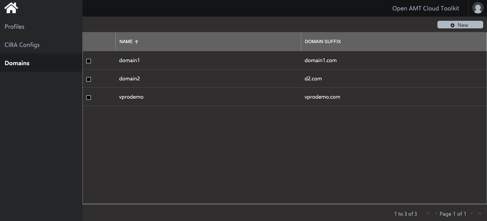
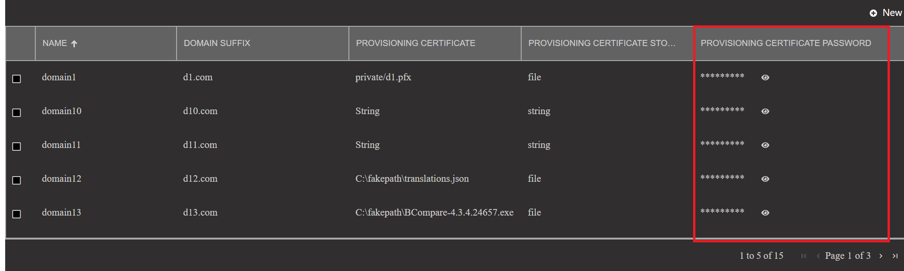
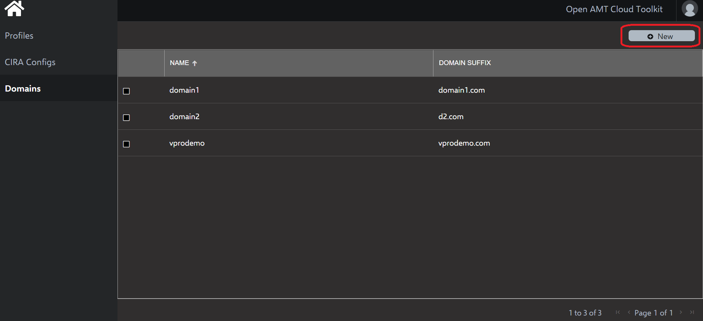
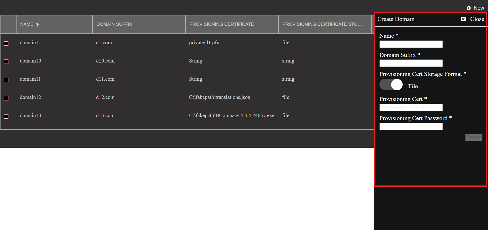
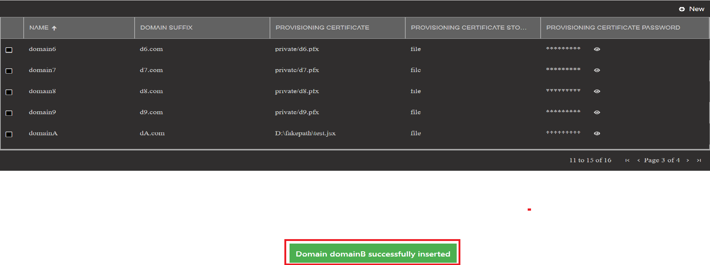
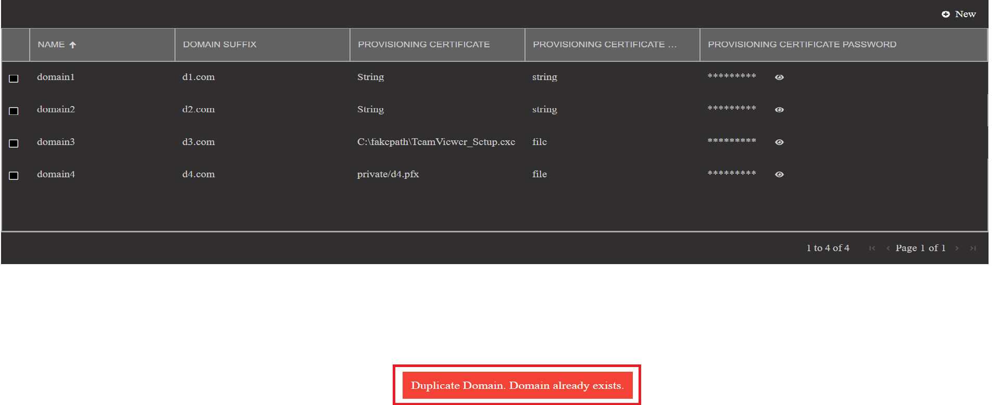
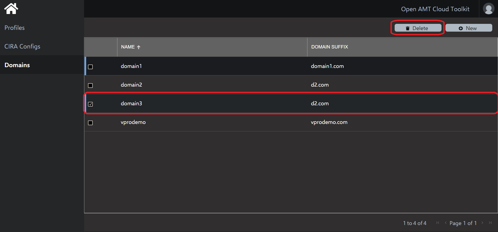
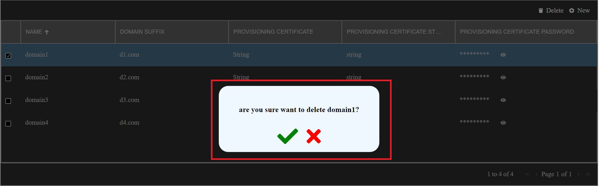
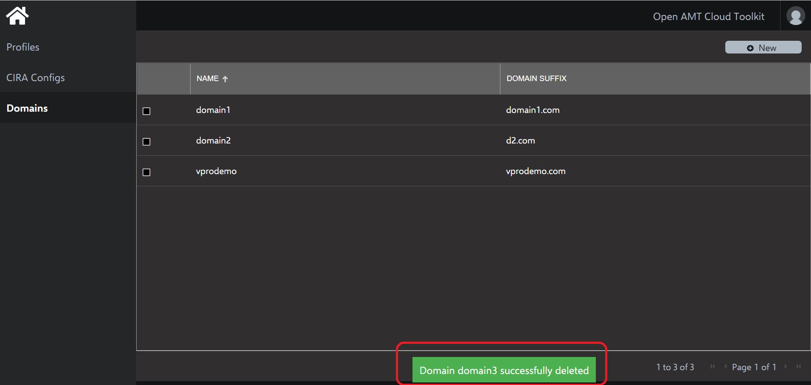

# Quickstart - Using Domain control features

This document provides information on how to use Domain control features from the UI. 

Using the Domain control  solution, one can add and delete Domain from the Database using RPS microservices through Web console.

## Domain control

On loading the Domain control in the web console, one will see the list of Domain avaialbale in the database in a tabular format as below

	 

In the Domain grid, the password details are masked and can be un-masked by clicking on the *eye* icon as shown below.

	 

### Create Domains

A button 'new' is provided to add a new Domain to the database.

	 

On click of 'new' button a flyout with a form to enter the Domain details will open and one can enter the details and click the create button to save the Domain in database.

	 

#### Input field validations

Listed below are the validations against the mandatory fields for the create domain form

| Field Name | Validation |
|--|--|
|Name | Should be unique, can contain alphanumeric, special characters |
|Password|  Should be between 8 and 32 in length and must have at least one lowercase, one uppercase alphabets, one numeric digit and one special character |

On successful insertion of Domain a success message will be shown  on the page as shown below and newly added Domain will be shown in the Domain list.

	 

In case if a user tries to add an Domain script which already exists in the database, then an error message will be shown to the user as shown below.

	 

### Delete Domain

Upon selecting any Domain by clicking on the checkbox against the Domain details row, a 'delete' button is shown on the header of Domain control.

	 

On click of delete button a popup will be shown asking for confirmation to delete the Domain as shown below.

	 

On clicking confirm[green tick] popup will disappear and success message to indicate successful deletion of Domain is shown on the page and Domain list gets refreshed.

	 

 

