# Quickstart - Using Network configs control features

This document provides information on how to use Network configs control features from the UI. 

Using the Network configs control  solution, one can add and delete Network configs from the Database using RPS microservices through Web console.

## Network configs control

On loading the Network configs control in the web console, one will see the list of Network configs avaialbale in the database in a tabular format as below

	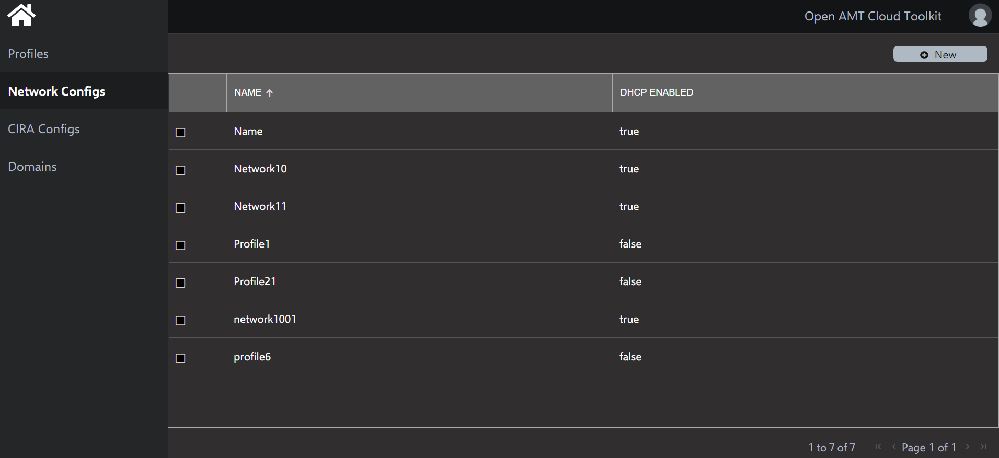 

### Create Network configs

A button 'New' is provided to add a new Network config to the database.

	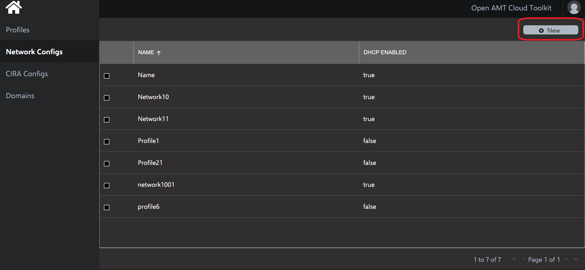 

On click of 'New' button a flyout with a form to enter the Network config details will open and one can enter the details and click the create button to save the Network config in database.

	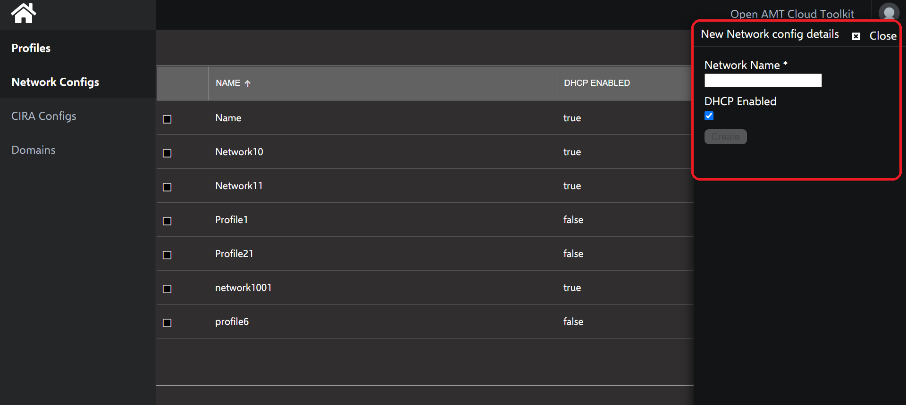 

#### Input field validations

Listed below are the validations against the mandatory fields for the create profile form

| Field Name | Validation |
|--|--|
|Netowrk Name | Should be unique, can contain alphanumeric, special characters |
|DHCP Enabled | Checkbox which determines whether to set Static IP configuration or Dynamic IP |

On successful insertion of Network config a success message will be shown  on the page as shown below and newly added Network config will be shown in the Network config list.

	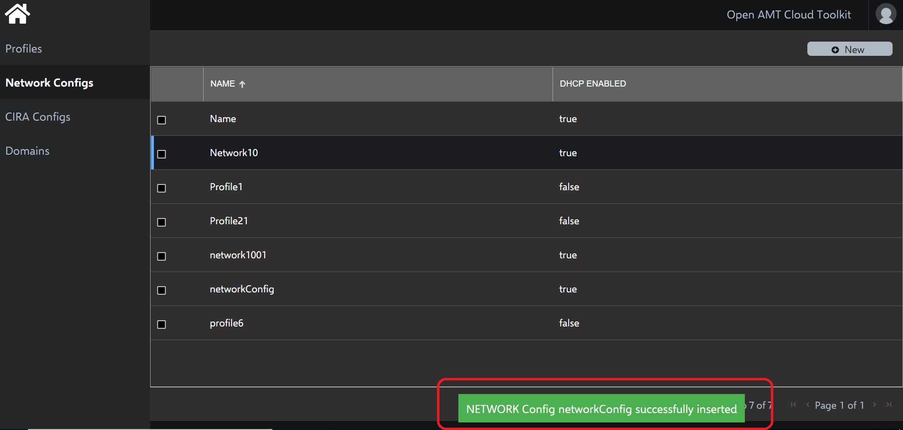 

In case if a user tries to add an Network config script which already exists in the database, then an error message will be shown to the user as shown below.

	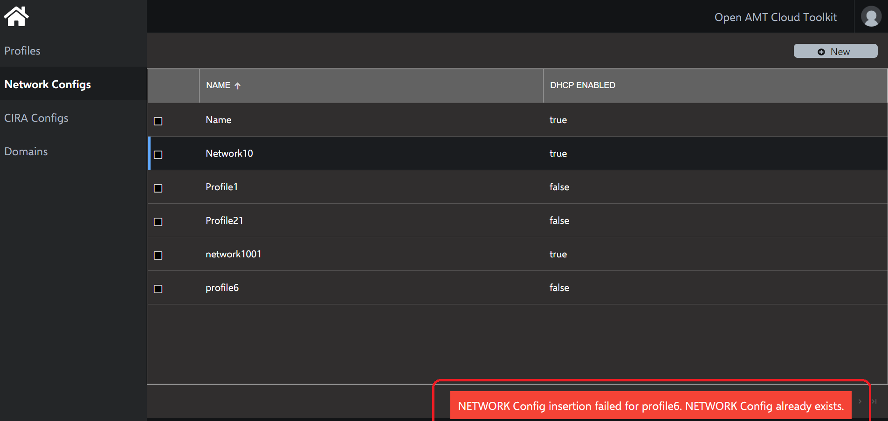 

### Delete Network config

Upon selecting any Network config by clicking on the checkbox against the Network config details row, a 'Delete' button is shown on the header of Network configs control.

	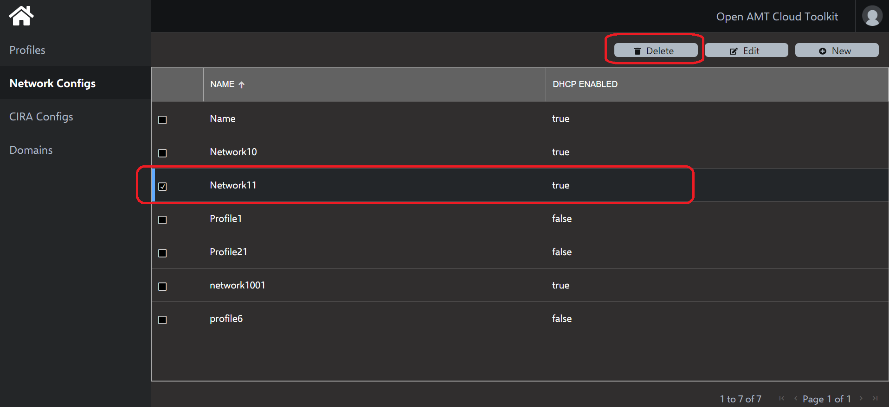 

On click of 'Delete' button a popup will be shown asking for confirmation to delete the Network config as shown below.

	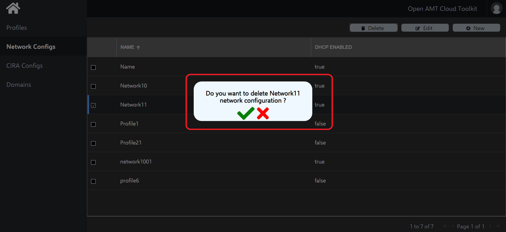 

On clicking confirm[green tick] popup will disappear and success message to indicate successful deletion of Network config is shown on the page and Network config list gets refreshed.

	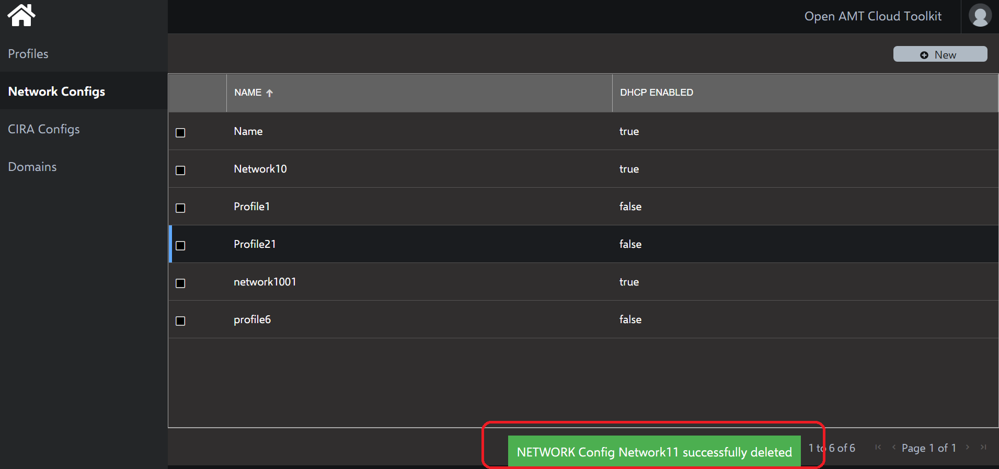 

In case user tries to delete a Network config which is associated with a Profile, an error message will be shown as below

	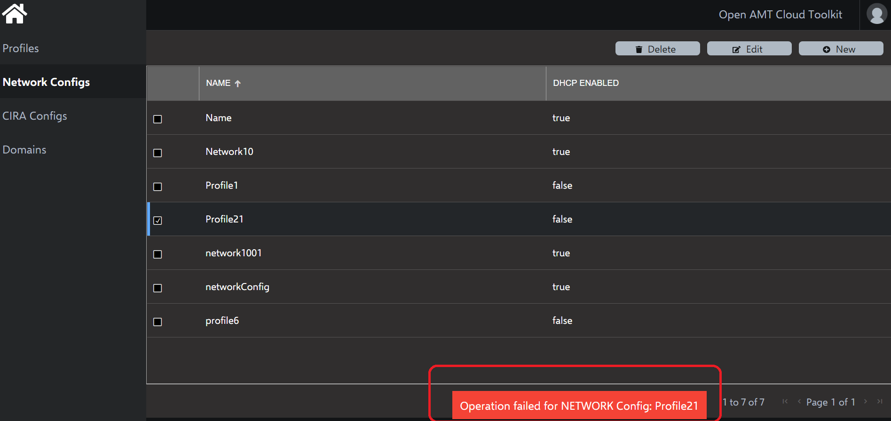 

### Edit Network Config
 
Upon selecting any Network config by clicking on the checkbox against the Network config details row, an 'Edit' button is shown on the header of Network COnfig control.

	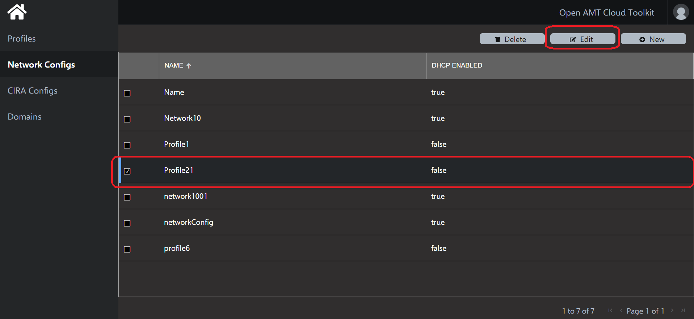 

On click of 'Edit' button selected Network Config details will be populated on the form as shown.

	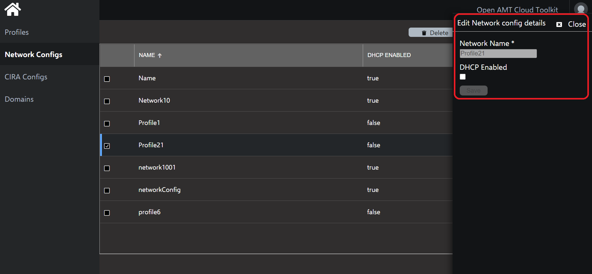 

After editing the details, on clicking the Save button the Network Config details will get updated on the grid and success message will be shown.

	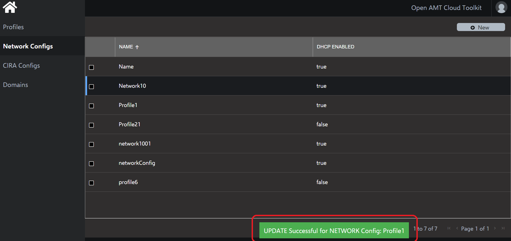 

In case user tries to edit a Network config which is associated with a Profile, an error message will be shown as below

	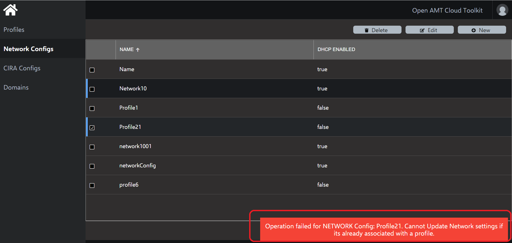 

 

