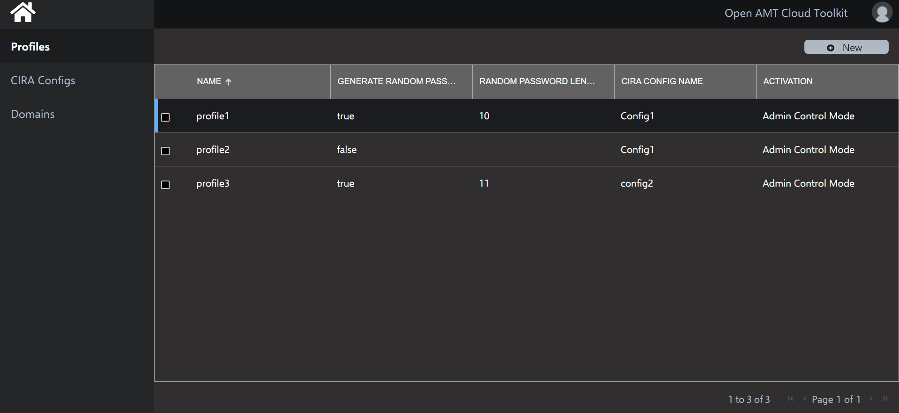
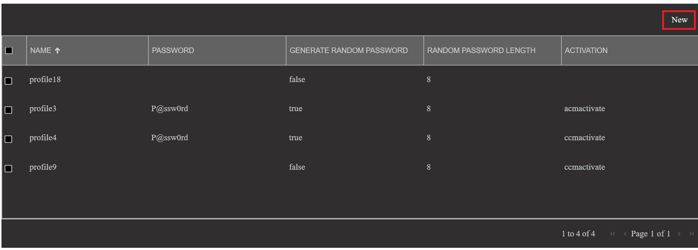
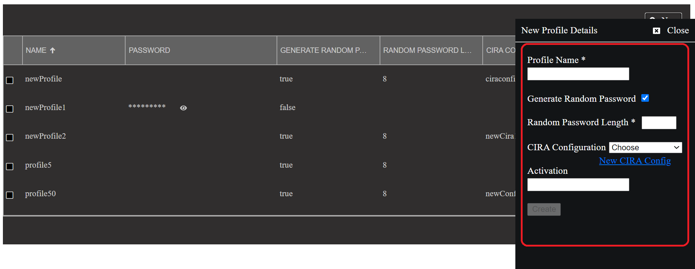
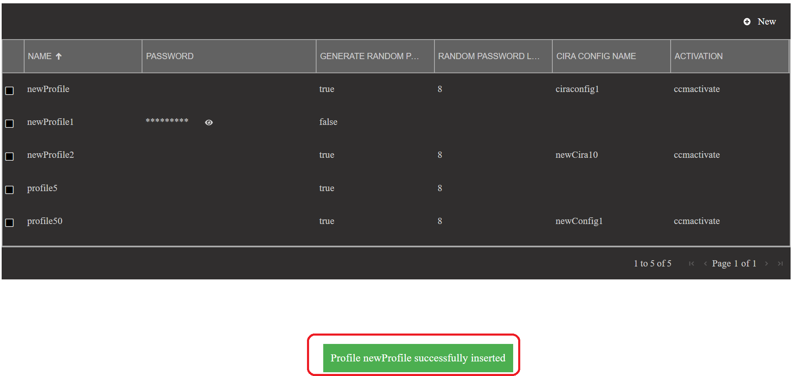
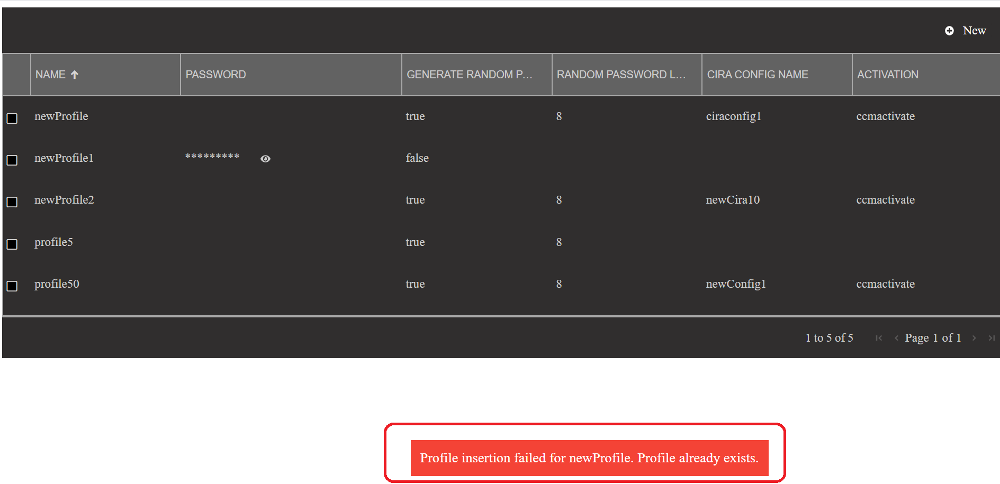
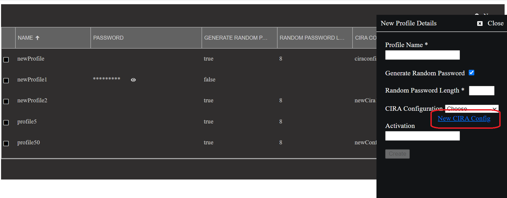
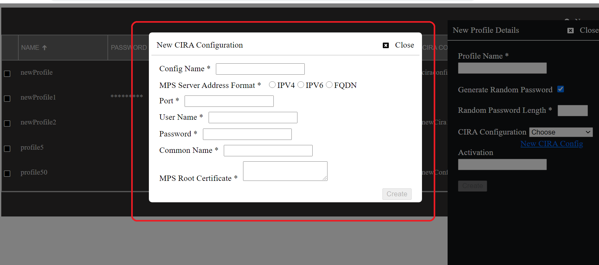
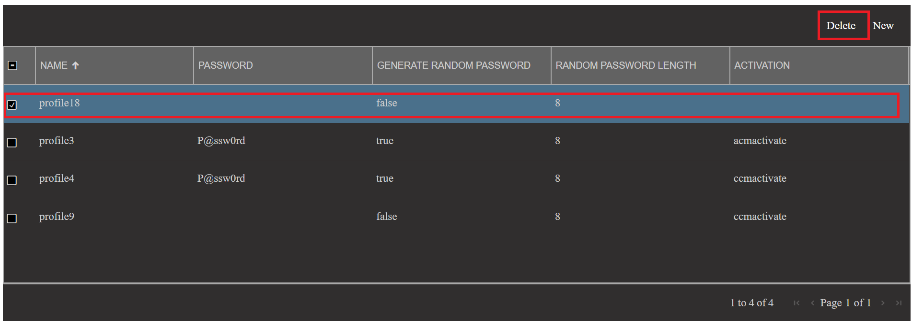
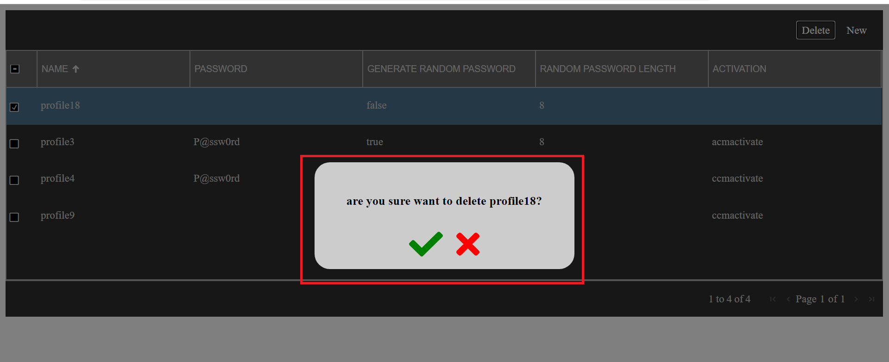
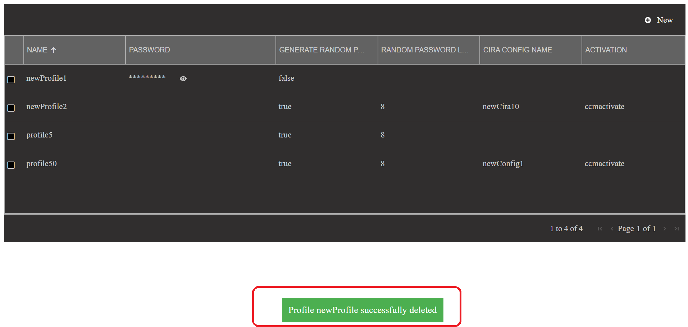

# Quickstart - Using Profile control features

This document provides information on how to use Profile control features from the UI. 

Using the Profile control  solution, one can add and delete profiles from the Database using RPS microservices through Web console.

## Profile control

On loading the profile control in the web console, one will see the list of profiles avaialbale in the database in a tabular format as below

	 

### Create profile

A button 'new' is provided to add a new profile to the database.

	 

On click of 'new' button a flyout with a form to enter the profile details will open and one can enter the details and click the create button to save the profile in database.

	 

#### Input field validations

Listed below are the validations against the mandatory fields for the create profile form

| Field Name | Validation  |
|--|--|
|Profile Name  | Should be unique, can contain alphanumeric, special characters |
|Generate Random Password | checkbox, by default checked 
| AMT password | Should be between 8 and 32 in length and must have at least one lowercase, one uppercase alphabets, one numeric digit and one special character
|Random Password Length| Number, should be between 8 and 32|
|CIRA configuration script| Contains all the CIRA configuration scripts available listed as a dropdown  |
|Activation | Optional field, Specifies about activation/control mode (CCM or ACM) |

On successful insertion of profile a success message will be shown  on the page as shown below and newly added profile will be shown in the profile list.

	 

in case there is a profile already exists with the same name as the one we are creating, an error will be shown on the UI as below

	 

### Create new CIRA config script

A 'New CIRA Config' link is provided on the create profile flyout to create a new CIRA config script if one does not want to use the existing CIRA config scripts

	 

On click of 'New CIRA Config' link a popup form will be shown and one can enter the details and create a new CIRA config script.

	 

### Delete profile

Upon selecting any profile by clicking on the checkbox against the profile details row, a 'delete' button is shown on the header of profile control.

	 

On click of delete button a popup will be shown asking for confirmation to delete the profile as shown below.

	 

On clicking confirm[green tick] popup will disappear and success message to indicate successful deletion of profile is shown on the page and profile list gets refreshed.

	 

 

